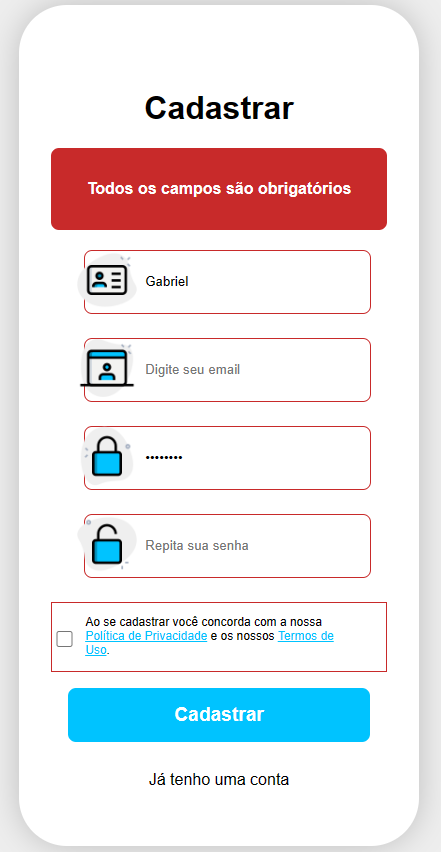
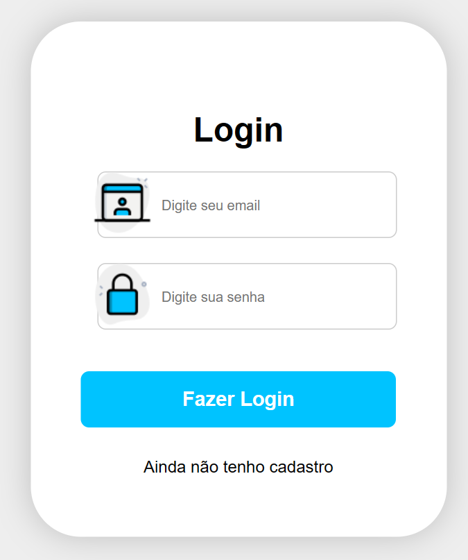
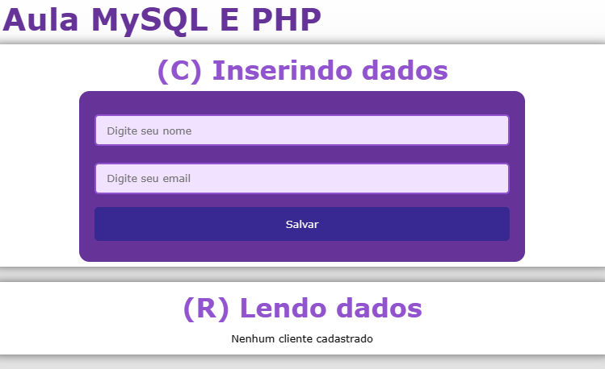
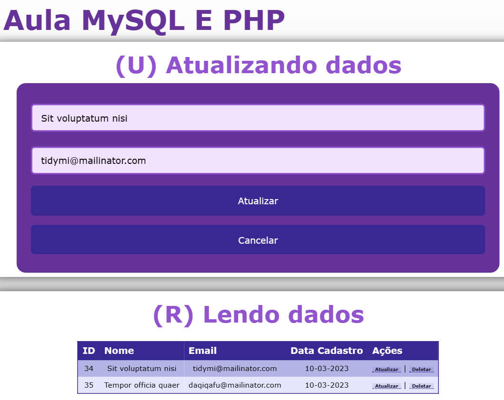
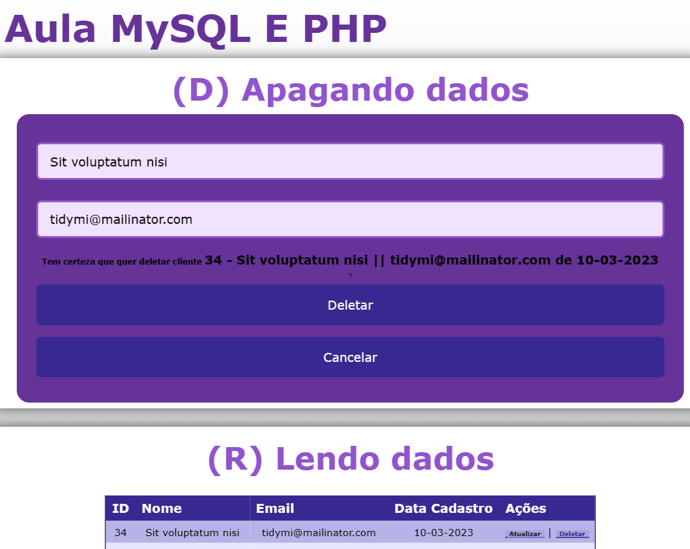
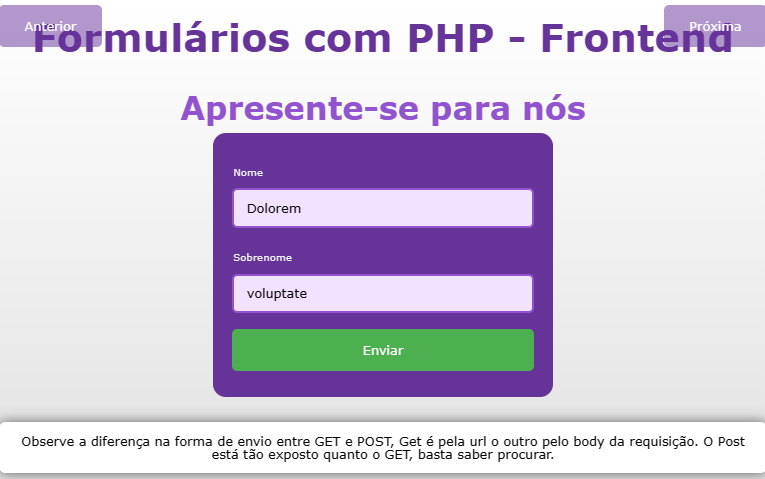
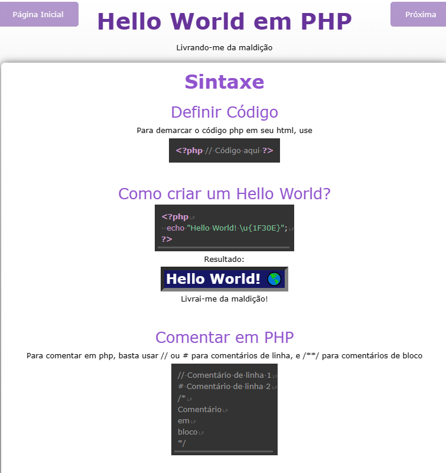
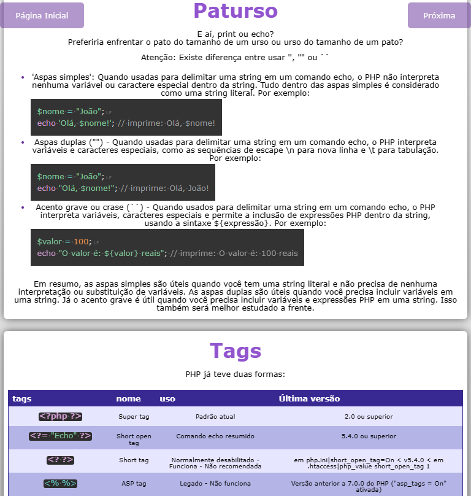

# PHP Studies
Repositório para armazenar meu desenvolvimento no aprendizado de PHP.

## Sumário
- [0 - Sumário](#)
- [1 - Link do Deploy](#)
- [2 - Conteúdo](#)
- [3 - Cases realizados](#)

## Link do deploy
https://deori-php-studies.vercel.app/
###### Ainda não atualizado pois demanda configurações a parte

## Conteúdo
Conteúdo Oficial Estudado:
 - [x] Curso PHP Completo Aula 01 - Introdução ao PHP
 - [x] Curso PHP Completo Aula 02 - Instalação do XAMPP
 - [x] Curso PHP Completo Aula 03  - Criando novo projeto localhost
 - [x] Curso PHP Completo Aula 04 - Sintaxe
 - [x] Curso PHP Completo Aula 05 - Variáveis
 - [x] Curso PHP Completo Aula 06 - Echo e Print
 - [x] Curso PHP Completo Aula 07 - Tipos de Dados
 - [x] Curso PHP Completo Aula 08 - Manipulação de Strings
 - [x] Curso PHP Completo Aula 09 - Manipulação de Números
 - [x] Curso PHP Completo Aula 10 - Funções Matemáticas
 - [x] Curso PHP Completo Aula 11 - Constantes
 - [x] Curso PHP Completo Aula 12 - Operadores
 - [x] Curso PHP Completo Aula 13 - If Else Elseif e Switch
 - [x] Curso PHP Completo Aula 14 - Loops (While, Do...While, For e Foreach)
 - [x] Curso PHP Completo Aula 15 - Funções
 - [x] Curso PHP Completo Aula 16 - Arrays (Matrizes)
 - [x] Curso PHP Completo Aula 17 - Superglobais
 - [x] Curso PHP Completo Aula 18 - Método $_GET
 - [x] Curso PHP Completo Aula 19 - Método $_POST
 - [x] Curso PHP Completo Aula 20 - Validação de Formulário
 - [x] Curso PHP Completo Aula 21 - Manipulação de Data e Hora
 - [x] Curso PHP Completo Aula 22 - Include e Require
 - [x] Curso PHP Completo Aula 23 - Manipulação de Pastas
 - [x] Curso PHP Completo Aula 24 - Manipulação de Arquivos
 - [x] Curso PHP Completo Aula 25 - Upload de Arquivos Únicos e Múltiplos
 - [x] Curso PHP Completo Aula 26 - Cookies
 - [x] Curso PHP Completo Aula 27 - Sessions
 - [x] Curso PHP Completo Aula 28 - JSON PHP
 - [x] Curso PHP Completo Aula 29 - cURL
 - [x] Curso PHP Completo Aula 30 - Introdução Ao Banco de Dados MySQL
 - [x] Curso PHP Completo Aula 31 - Criar Tabela Banco de Dados (MySQL)
 - [x] Curso PHP Completo Aula 32 - Conectando e Inserindo Dados no Banco (Mysql)
 - [x] Curso PHP Completo Aula 33 - Selecionar Registros SELECT (MySQL)
 - [x] Curso PHP Completo Aula 34 - Atualizar Registros UPDATE (MySQL)
 - [x] Curso PHP Completo Aula 35 - Deletar Registros DELETE (MySQL)
 - [x] Curso PHP Completo Aula 36 - Order By e Limit (MySQL)
 - [x] Curso PHP Completo Aula 37 - Exportar e Importar Banco MySQL
 - [x] Curso PHP Completo Aula 38 - Sistema de Login (Parte 1)
 - [x] Curso PHP Completo Aula 39 - Sistema de Login (Parte 2)
 - [ ] Curso PHP Completo Aula 40 - Sistema de Login (Parte 3)
 - [ ] Curso PHP Completo Aula 41 - Introdução a PHP Orientado a Objetos
 - [ ] Curso PHP Completo Aula 42 - Construct, Destruct e Visibilidade de Propriedades
 - [ ] Curso PHP Completo Aula 43 - Herança e Visibilidade de Métodos
 - [ ] Curso PHP Completo Aula 44 - Constantes e Autoloading de Classes
 - [ ] Curso PHP Completo Aula 45 - Classes e Métodos Abstratos
 - [ ] Curso PHP Completo Aula 46 - Interfaces e Traits
 - [ ] Curso PHP Completo Aula 47 - Métodos e Propriedades Estáticas
 - [ ] Curso PHP Completo Aula 48 - Namespaces e melhor organização
 - [ ] Curso PHP Completo Aula 49 - Sistema Login POO (Parte 1)
 - [ ] Curso PHP Completo Aula 50 - Sistema Login POO (Parte 2)

## Cases e Conteúdo realizado
### Cadastro
formulário de cadastro de login completo com validação completa e com cadastro realizado em banco de dados MySQL.

### Login

 Tela de login, já foram feitas as validações de email e senha, acesso ao banco de dados para conferência da senha e geração de token usando as técnicas de cookies ou session/local storage. Verificação de email, falta apenas tela de recuperar senha.

### C.R.U.D
Formulário de clientes - CRUD completo com validação completa de nome, email e cadastro no banco de dados MySQL.

#### Create

#### Read and Update

#### Read and Delete

### Form simples
Formulário básico sem validação

### Conteudo BetaBit - Documentação de aprendizado em PHP
Documentação geral do conteúdo oficial feita utilizando PHP e técnicas em JS para melhor visualização de código e resultado. (metadoc);

### Conteúdo Curso em vídeo - Documentação em PHP
Documentação geral do curso em vídeo feita utilizando PHP e técnicas em JS para melhor visualização de código e resultado. (metadoc);

